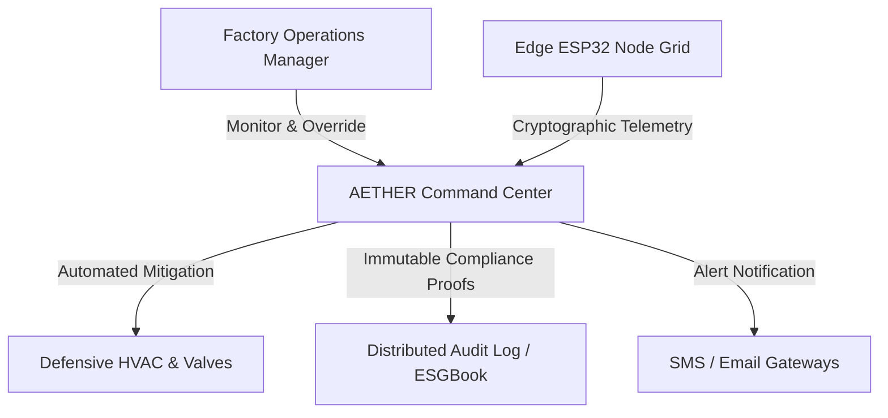
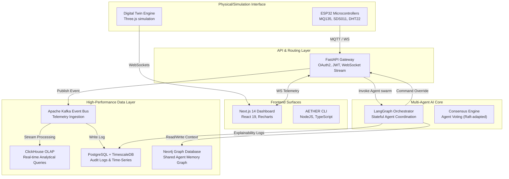
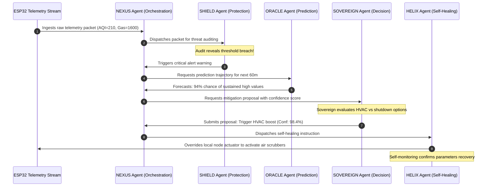

# AETHER Network: System Architecture & Data Flow

This document details the multi-layered system architecture of the **AETHER Network** using the C4 model guidelines, outlining how edge sensors, autonomous agents, event brokers, and frontend layers interact.

---

## 1. System Context Diagram (C4 Level 1)

The context diagram outlines the primary boundaries of the AETHER platform, showing how external organizations, hardware sensors, and operations teams interact with the core engine.

---

## 2. Container Architecture Diagram (C4 Level 2)

This diagram details the containerized services that make up the AETHER ecosystem, highlighting the tech stack and integration boundaries.

---

## 3. Sovereign Multi-Agent Interaction Map

AETHER's intelligence layer operates as a multi-tier agent society. Agents communicate via an asynchronous Event Bus and share access to a persistent Graph Memory.

---

## 4. Infrastructure & Scaling Strategy

### 100M User / Five-Nines Scaling Blueprint
*   **Edge Processing**: Heavy compression and pre-filtering on local gateways before ingestion into AWS API Gateway.
*   **Event Ingestion**: Scaled Apache Kafka cluster deployed across 3 availability zones in active-active configurations, capable of handling 500,000 requests/sec.
*   **Database Partitioning**:
    *   **TimescaleDB**: Telemetry data partitioned by `timestamp` and `node_id` in 24-hour chunks to prevent index bloat.
    *   **PostgreSQL**: Metadata tables replicated across 5 global regions using AWS Aurora Global Database (sub-second lag).
    *   **ClickHouse**: Cold-data storage for deep compliance queries, compressing raw data at 5:1 ratio.
*   **Edge Execution**: Cloudflare Workers deployed globally as edge brokers, returning static dashboard updates in under 10ms.
